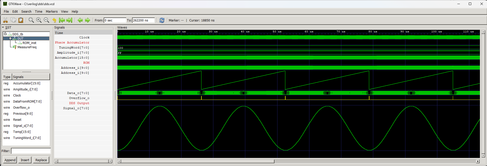

# DDS


Direct Digital Synthesis.

The module generates an 8-bit sine wave signal. It should be fed to the DAC outside the FPGA. The sine signal samples are stored in ROM memory which is organized as 1024x8bit so a single EBR block in Lattice MachXO2 is enough for this purpose.

The address of the currently processed sample is selected by the counter with phase accumulator. This solution allows you to smoothly adjust the frequency of the generated signal using the `TuningWord_i` input - the larger the number supplied to this input, the higher the frequency.

The 8-bit `Amplitude_i` input is used to digitally adjust the signal amplitude. This is implemented by multiplying the 8-bit sample by the 8-bit value of `Amplitude_i`. Multiplying two 8-bit variables results in a 16-bit variable. We only use the 8 most signifficant bits of this variable and the 8 least signifficant bit are discarded.


## Instantiation

```verilog
	DDS DDS_inst(
		.Clock(Clock),
		.Reset(Reset),
		.TuningWord_i(),
		.Amplitude_i(),
		.Signal_o(),
		.Overflow_o()
	);
```

## Port description

+ **Clock** - Clock signal, active rising edge.
+ **Reset** - Asynchronous reset, active low.
+ **TuningWord_i[7:0]** - Frequency setting.
+ **Amplitude_i[7:0]** - Amplitude setting.
+ **Signal_o[7:0]** - Output to DAC.
+ **Overflow_o** - High strobe indicates the overflow of the counter.

## Simulation




## Console output

	VCD info: dumpfile dds.vcd opened for output.
	===== START =====
	   0.052ms  38167.939 Hz
	   0.079ms  38109.756 Hz
	   0.105ms  38167.939 Hz
	   0.131ms  38167.939 Hz
	   0.157ms  38109.756 Hz
	   0.184ms  38167.939 Hz
	   0.210ms  38167.939 Hz
	   0.236ms  38109.756 Hz
	====== END ======
	dds_tb.v:63: $finish called at 262200000 (1ps)
