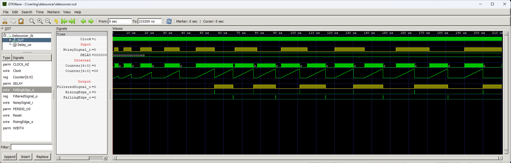

# Debouncer

A module used to filter the vibration of mechanical button contacts. After changing the state of the input `NoisySignal_i`, the module waits the time specified by the parameter . If the input state is stable during this time, then the output state `FilteredSignal_o` changes.

## Instantiation

	Debouncer #(
		.CLOCK_HZ(CLOCK_HZ),
		.PERIOD_US()
	) Debouncer_inst(
		.Clock(Clock),
		.Reset(Reset),
		.NoisySignal_i(),
		.FilteredSignal_o()
	);

## Port description

+ **CLOCK_HZ** - Clock signal frequency [Hz].
+ **PERIOD_US** - Period of strobe signals [us].
+ **Clock** - Clock signal, active rising edge.
+ **Reset** - Asynchronous reset, active low.
+ **NoisySignal_i** - Not filtered signal directly from a button or other mechanical switch.
+ **FilteredSignal_o** - Filtered signal without glitches.

## Simulation

## Console output

	VCD info: dumpfile debouncer.vcd opened for output.
	===== START =====
	CLOCK_HZ  =  10000000
	PERIOD_US =        10
	DELAY     =        99
	WIDTH     =         7
	====== END ======
	debouncer_tb.v:53: $finish called at 210200 (1ns)
