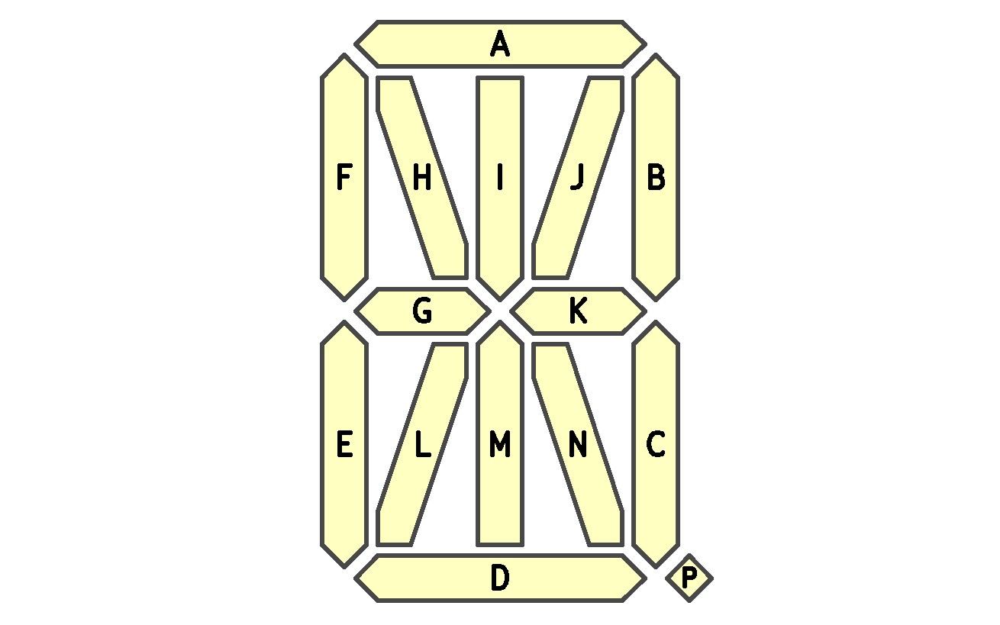
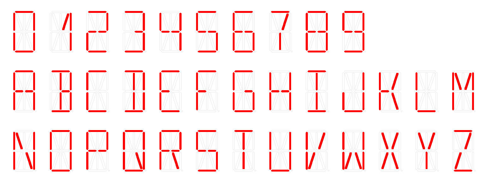
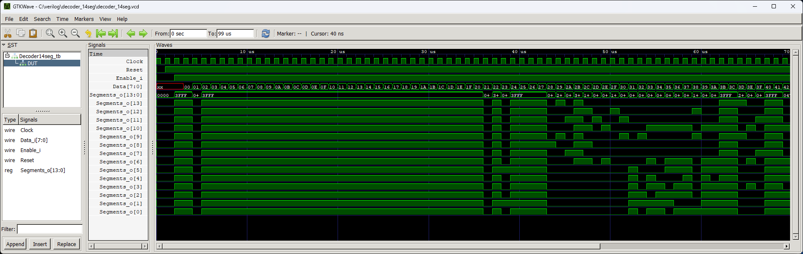

# 14 Segment Display Decoder


Simple module to convert 8-bit ASCII data into 14-segment code that can drive a 14-segment display. Supports displaying digits from 0 to 9, letters from A to Z and some other characters. Designed to be used with `display_lcd_vim828`.




## Instantiation

```verilog
	Decoder14seg Decoder14seg_inst(
		.Clock(Clock),
		.Reset(Reset),
		.Enable_i(),
		.Data_i(),
		.Segments_o()
	);
```

## Port description

+ **Clock** - Clock signal, active rising edge.
+ **Reset** - Asynchronous reset, active low.
+ **Enable_i** - If 1 then display is enabled, if 0 then all segments are disabled.
+ **Data_i[7:0]** - ASCII code to be displayed.
+ **Segments_o[14:0]** - Driver output.
	+ **Segments_o[0]** - Segment A
	+ **Segments_o[1]** - Segment B
	+ **Segments_o[2]** - Segment C
	+ **Segments_o[3]** - Segment D
	+ **Segments_o[4]** - Segment E
	+ **Segments_o[5]** - Segment F
	+ **Segments_o[6]** - Segment G
	+ **Segments_o[7]** - Segment H
	+ **Segments_o[8]** - Segment I
	+ **Segments_o[9]** - Segment J
	+ **Segments_o[10]** - Segment K
	+ **Segments_o[11]** - Segment L
	+ **Segments_o[12]** - Segment M
	+ **Segments_o[13]** - Segment N
	+ **Segments_o[13]** - Segment P (decimal point)
  
## Simulation



## Console output

	VCD info: dumpfile decoder_14seg.vcd opened for output.
	===== START =====
	====== END ======
	decoder_14seg_tb.v:48: $finish called at 99000 (1ns)
