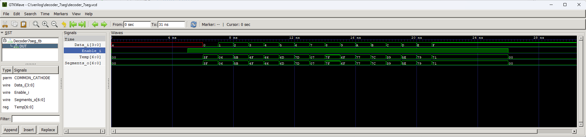

# 7 Segment Display Decoder

Simple module to convert 4-bit binary data into 7-segment code that can drive a 7-segment display. Supports displaying digits from 0 to 9 and hexadecimal values from A to F.

Made as a fully combinational logic without any clock and reset signals. Can be used with common cathode and common anode displays.

## Instantiation

    Decoder7seg #(
        .COMMON_CATHODE(1)
    ) Decoder7seg_inst(
        .Enable_i(),
        .Data_i(),
        .Segments_o()
    );

## Port description

+ **COMMON_CATHODE** - 1 for common cathode display, 0 for common anode.
+ **Enable_i** - If 1 then display is enabled, if 0 then all segments are disabled. This input can be used to implement display multiplexing.
+ **Data_i[3:0]** - Data to be displayed.
+ **Segments_o[6:0]** - Driver output. Remember about resistors to limit LEDs current!
    
## Simulation

## Console output

    VCD info: dumpfile decoder_7seg.vcd opened for output.
    ===== START =====
          Time  i Data Segments
       0.000ns  x xxxx 0000000
       5.000ns  0 xxxx 0000000
       6.000ns  1 0000 0111111
       7.000ns  2 0001 0000110
       8.000ns  3 0010 1011011
       9.000ns  4 0011 1001111
      10.000ns  5 0100 1100110
      11.000ns  6 0101 1101101
      12.000ns  7 0110 1111101
      13.000ns  8 0111 0000111
      14.000ns  9 1000 1111111
      15.000ns 10 1001 1101111
      16.000ns 11 1010 1110111
      17.000ns 12 1011 1111100
      18.000ns 13 1100 0111001
      19.000ns 14 1101 1011110
      20.000ns 15 1110 1111001
      21.000ns 16 1111 1110001
      26.000ns 16 1111 0000000
    ====== END ======
    decoder_7seg_tb.v:32: $finish called at 31 (1ns)