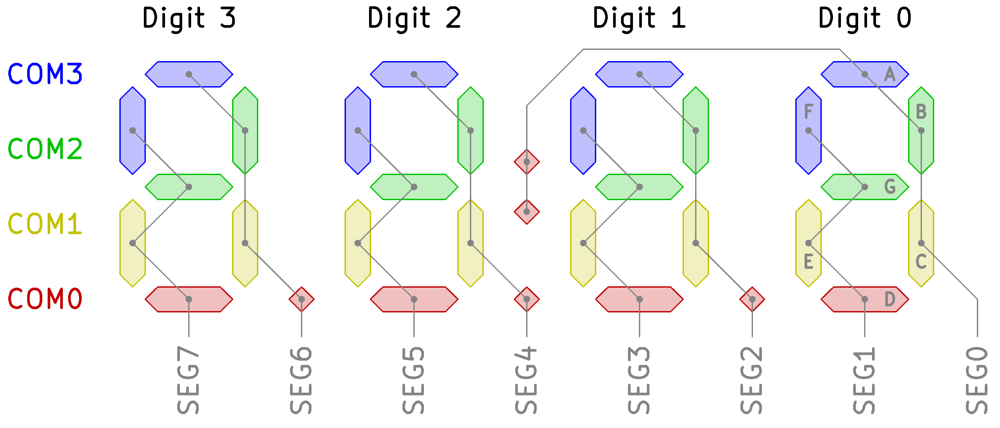
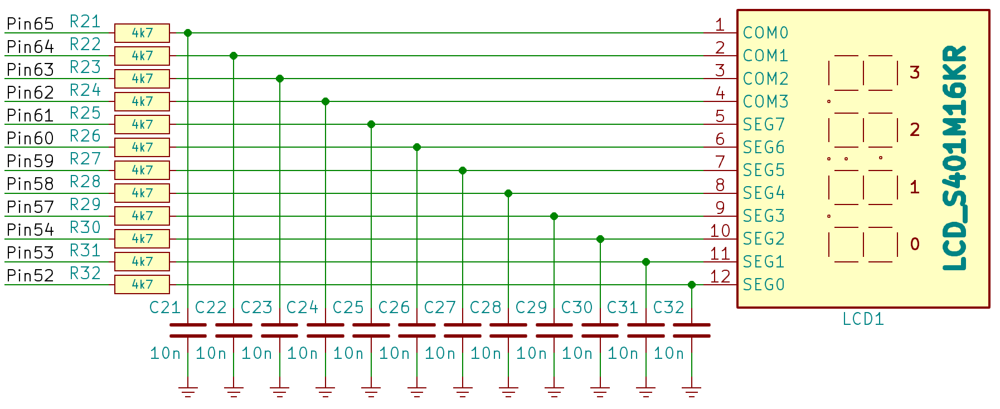
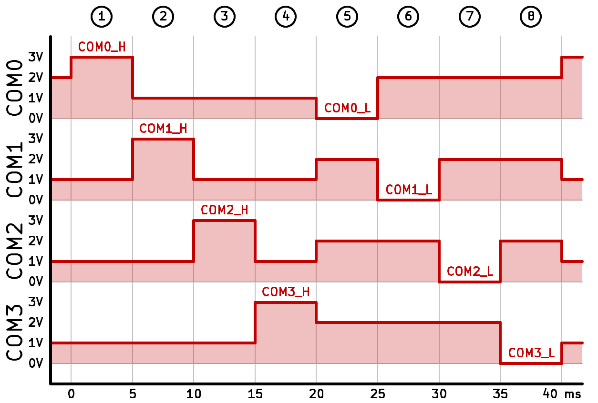
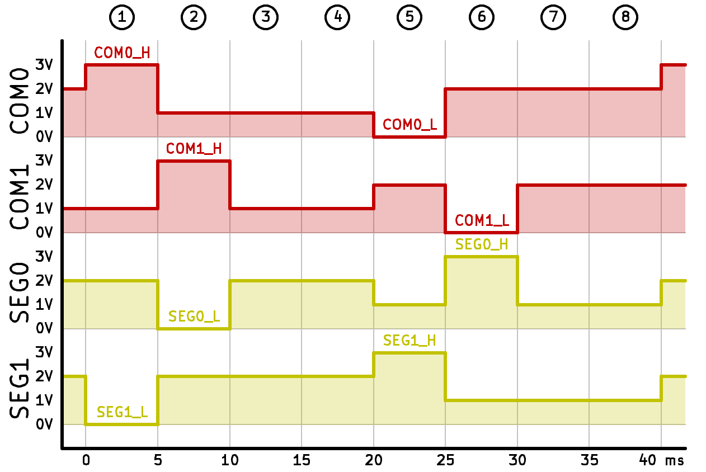
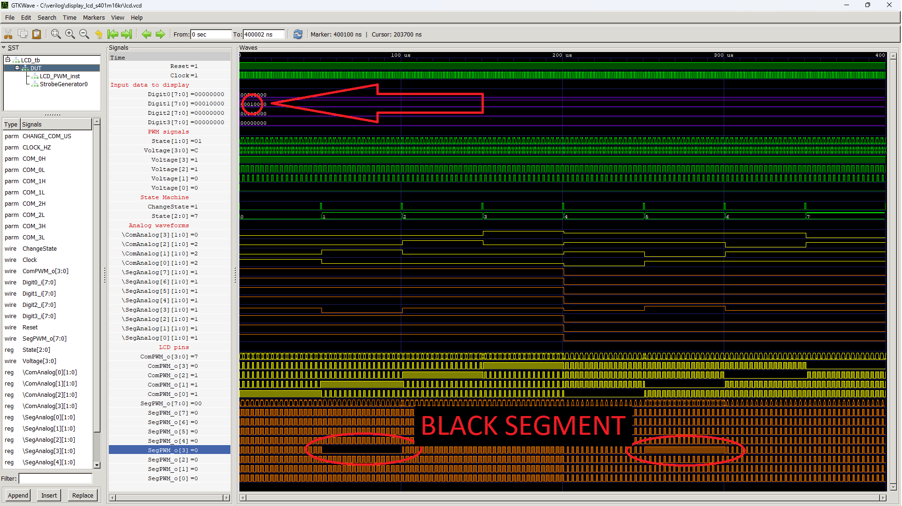

# LCD Multiplexed display - driver for S401M16KR display

>**Status**: ready

Multiplexing an LCD display is much more difficult than for an LED display. This controller works with the S401M16KR display from Lumex. This display works with 1/4 duty, that is, it has four electrodes in common COM and 1/3 bias, that is, the control voltage of the electrodes can have 4 different values.

The display has four COM common electrodes and eight SEG segment control electrodes. The internal schematic of the display is shown in the figure below.

The display should be connected to the FPGA this way. There are RC filters for each pin of the display to filter out the noise coming from PWM. RC filters should be placed as close to FPGA as possible.

The average voltage on each pin, calculated over the entire period of display control, must be equal to 0V. Applying DC voltage for a long time will lead to damage to the display. 

For this reason, the display control cycle is divided into 8 phases (the number of COM electrodes multiplied by 2). The first four phases are called positive, and the next four are called negative. For the positive phases, the active COM electrode has a voltage of 3V, and the inactive ones have 1V. On an opposite side, for negative phases, the active COM electrode has a voltage of 0V and the inactive one has 2V.

The waveforms on the COM electrodes are shown in the figure below. Such waveforms should be supplied to the COM electrodes no matter what is shown on the display.

The active segment in positive phases has a voltage of 0V, and the inactive segment has a voltage of 2V. The active segment in negative phases has a voltage of 3V, and the inactive segment has a voltage of 1V. See the waveforms below.

To make the selected segment visible (black), you need to activate the corresponding SEG and COM electrodes at the same time. 

## Instantiation

    LCD #(
        .CLOCK_HZ(CLOCK_HZ),
        .CHANGE_COM_US(50)
    ) LCD_inst(
        .Clock(Clock),
        .Reset(Reset),
        .Digit3_i(),
        .Digit2_i(),
        .Digit1_i(),
        .Digit0_i(),
        .ComPWM_o(),
        .SegPWM_o()
    );
    
## Port description

+ **CLOCK_HZ** - Clock signal frequency [Hz].
+ **CHANGE_COM_US** - The time how long each COM is active in [us].
+ **DIGITS** - The number of digits in the display.
+ **Clock** - Clock signal, active rising edge.
+ **Reset** - Asynchronous reset, active low.
+ **Digit3_i[7:0]** - Input segments digit 3; high state causes segment visible, bit order is pgfedcba.
+ **Digit2_i[7:0]** - Input segments digit 2; high state causes segment visible, bit order is pgfedcba.
+ **Digit1_i[7:0]** - Input segments digit 1; high state causes segment visible, bit order is pgfedcba.
+ **Digit0_i[7:0]** - Input segments digit 0; high state causes segment visible, bit order is pgfedcba.
+ **ComPWM_o[3:0]** - These outputs should be connected to the display's COM electrodes via an RC filter.
+ **SegPWM_o[3:0]** - These outputs should be connected to the display's SEG electrodes via an RC filter.

## Simulation

Demonstration of blackening of segment E of digit 1. COM1 and SEG3 pair is activated.

## Console output

    VCD info: dumpfile lcd.vcd opened for output.
    VCD warning: array word LCD_tb.DUT.ComAnalog[0] will conflict with an escaped identifier.
    VCD warning: array word LCD_tb.DUT.ComAnalog[1] will conflict with an escaped identifier.
    VCD warning: array word LCD_tb.DUT.ComAnalog[2] will conflict with an escaped identifier.
    VCD warning: array word LCD_tb.DUT.ComAnalog[3] will conflict with an escaped identifier.
    VCD warning: array word LCD_tb.DUT.SegAnalog[0] will conflict with an escaped identifier.
    VCD warning: array word LCD_tb.DUT.SegAnalog[1] will conflict with an escaped identifier.
    VCD warning: array word LCD_tb.DUT.SegAnalog[2] will conflict with an escaped identifier.
    VCD warning: array word LCD_tb.DUT.SegAnalog[3] will conflict with an escaped identifier.
    VCD warning: array word LCD_tb.DUT.SegAnalog[4] will conflict with an escaped identifier.
    VCD warning: array word LCD_tb.DUT.SegAnalog[5] will conflict with an escaped identifier.
    VCD warning: array word LCD_tb.DUT.SegAnalog[6] will conflict with an escaped identifier.
    VCD warning: array word LCD_tb.DUT.SegAnalog[7] will conflict with an escaped identifier.
    ===== START =====
    CLOCK_HZ =   1000000
          time C0 C1 C2 C3 S0 S1 S2 S3 S4 S5 S6 S7
       0.001us  3  1  1  1  2  2  2  2  2  2  2  2 
      51.000us  1  3  1  1  2  2  2  0  2  2  2  2 
     101.000us  1  1  3  1  2  2  2  2  2  2  2  2 
     151.000us  1  1  1  3  2  2  2  2  2  2  2  2 
     201.000us  0  2  2  2  1  1  1  1  1  1  1  1 
     251.000us  2  0  2  2  1  1  1  3  1  1  1  1 
     301.000us  2  2  0  2  1  1  1  1  1  1  1  1 
     351.000us  2  2  2  0  1  1  1  1  1  1  1  1 
    ===== END =====
    lcd_tb.v:91: $finish called at 400002 (1ns)

