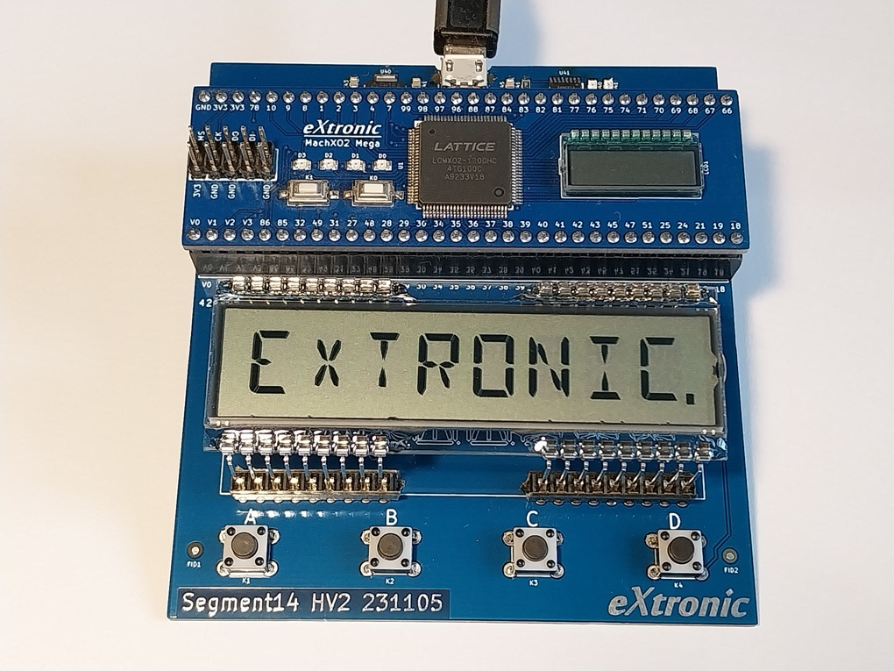
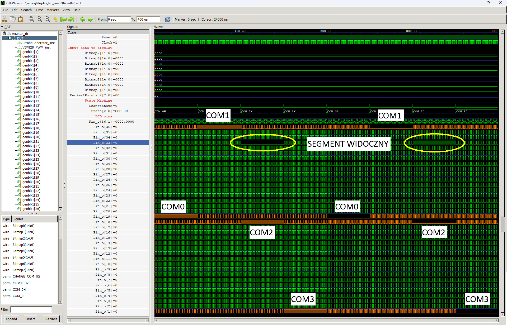

# LCD Multiplexed display - driver for VIM-828 display


A 14-segment display that supports 8 alphanumeric characters. Read the readme of `display_lcd_s401m16kr` to understand how LCD display works.



## Instantiation

```verilog
	VIM828 #(
		.CLOCK_HZ(CLOCK_HZ),
		.CHANGE_COM_US(1000)
	) VIM828_inst(
		.Clock(Clock),
		.Reset(Reset),
		.Segments7_i(),
		.Segments6_i(),
		.Segments5_i(),
		.Segments4_i(),
		.Segments3_i(),
		.Segments2_i(),
		.Segments1_i(),
		.Segments0_i(),
		.DecimalPoints_i(),
		.Pin_o()
	);
```

## Port description

+ **CLOCK_HZ** - Clock signal frequency [Hz].
+ **CHANGE_COM_US** - The time how long each COM is active in [us].
+ **Clock** - Clock signal, active rising edge.
+ **Reset** - Asynchronous reset, active low.
+ **SegmentsX_i[13:0]** - Input segments for each character. High state causes segment visible, bit order is nmlkjihgfedcba.
+ **DecimalPoints_i[7:0]** - Input for decimal points after each character.
+ **Pin_o[36:1]** - Connect to LCD.
  
## Simulation



## Console output

	VCD info: dumpfile decoder_14seg.vcd opened for output.
	===== START =====
	CLOCK_HZ =   1000000
	====== END ======
	decoder_14seg_tb.v:48: $finish called at 99000 (1ns)


