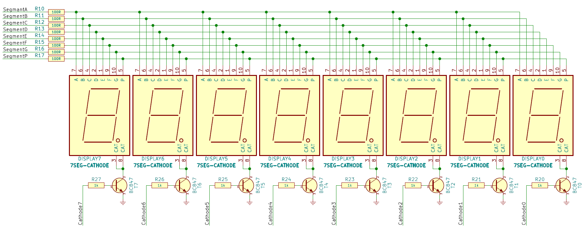
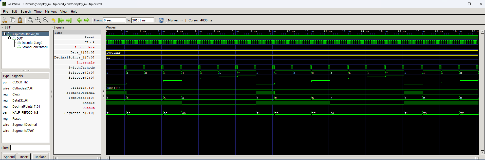

# LED Multiplexed display (fixed number of digits)

>**Status**: ready

Module that controls an 8-digit LED display with a common cathode. If you need a module that controls a display with an adjustable number of digits, see the `display_multiplex_variable` module.

Multiplexing means switching the displayed digits very quickly. At any given time, only one of them is lit, and all the others remain blank. In this module, multiplexing starts with the digit on the right side of the display and is called digit number 0. The digit on the left side is number 7.

The module has an option to blank out unnecessary zeros. This means that instead of `00123400` it will display ` 123400`. In addition, it is possible to light a decimal point in any place, or even several decimal points if desired.

You can adjust the multiplexing speed by changing the `SWITCH_PERIOD_US` parameter. This is the time in microseconds that determines how long a digit is displayed before switching to the next digit. This parameter should be adjusted experimentally. If you see the digits flashing then you need to decrease it. On the other hand, if you see "ghosting" of neighboring digits, it means that multiplexing is happening too fast and you need to increase this parameter.

The display should be connected to the FPGA chip as shown in the schematic below.

## Instantiation

    DisplayMultiplex #(
        .CLOCK_HZ(CLOCK_HZ),
        .SWITCH_PERIOD_US(1000)
    ) DisplayMultiplex_inst(
        .Clock(Clock),
        .Reset(Reset),
        .Data_i(),
        .DecimalPoints_i(),
        .Cathodes_o(),
        .Segments_o()
    );
    
## Port description

+ **CLOCK_HZ** - Clock signal frequency [Hz].
+ **SWITCH_PERIOD_US** - The time how long each cathode is active in [us].
+ **Clock** - Clock signal, active rising edge.
+ **Reset** - Asynchronous reset, active low.
+ **Data_i[63:0]** - Input in HEX; 4 bits for each digit.
+ **DecimalPoints[7:0]** - Each bit determines whether to light a decimal point on the corresponding digit.
+ **Cathodes_o[7:0]** - GPIO pins controlling the display cathodes.
+ **Segments_o[7:0]** - GPIO pins controlling the display segments.
+ **SwitchCathode_o** - Optional output used by the `MatrixKeboard` module.

## Simulation

## Console output

Example of displaying `    BEEF` on the display. First four digits are intentionally blank.

    VCD info: dumpfile display_multiplex.vcd opened for output.
    ===== START =====
    CLOCK_HZ =  10000000
    DELAY    =         9
    WIDTH    =         4
    Data     =  0000beef
          time  Sel Data Visible
           1us  0   f    1
           2us  1   e    1
           3us  2   e    1
           4us  3   b    1
           5us  4   0    0
           6us  5   0    0
           7us  6   0    0
           8us  7   0    0
           9us  0   f    1
          10us  1   e    1
          11us  2   e    1
          12us  3   b    1
          13us  4   0    0
          14us  5   0    0
          15us  6   0    0
          16us  7   0    0
          17us  0   f    1
          18us  1   e    1
          19us  2   e    1
          20us  3   b    1
    ===== END =====
    display_multiplex_tb.v:69: $finish called at 20101 (1ns)

