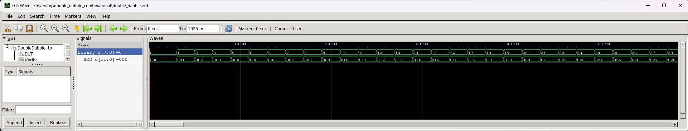

# Binary to BCD converter - Double Dabble algorithm (combinational)


Converter of binary values to BCD code, which is often used by display controllers. It uses the Double Dabble algorithm in a combinational implementation.

Testbench tries to convert all possible values from zero to maximum and from maximum to zero. After the test, it shows how many attempts were successful and failed.

## Instantiation

```verilog
	DoubleDabble #(
		.INPUT_BITS(),
		.OUTPUT_DIGITS(),
		.OUTPUT_BITS()      // Optional
	) DoubleDabble_inst(
		.Binary_i(),
		.BCD_o()
	);
```

## Port description

+ **INPUT_BITS** - The number of bits of the input value.
+ **OUTPUT_DIGITS** - How many digits are to be included in the result. 
+ **OUTPUT_BITS** - Optional parameter. Defaults to `OUTPUT_DIGITS` * 4, since there are 4 bits for each digit in the BCD code. However, if the most significant digit can change in an incomplete range (e.g. from 0 to 3) then there is no need for 4 bits, but 2.
+ **Binary_i** - Input binary value.
+ **BCD_o** - Output in BCD code.

## Simulation



## Console output

	VCD info: dumpfile double_dabble.vcd opened for output.
	===== START =====
	Pass:         512
	Fail:           0
	====== END ======
	double_dabble_tb.v:100: $finish called at 1025000 (1ns)
