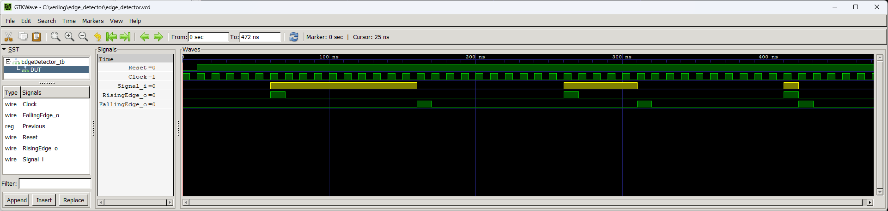

# Melody Player


A simple module that is used to detect the rising and falling edge of any signal. If a change in the signal is detected, a pulse of one clock cycle length will be generated on the `RisingEdge_o` and `FallingEdge_o` outputs. Important - the signal under test must be synchronized with the clock.

## Instantiation

```verilog
	EdgeDetector EdgeDetector_inst(
		.Clock(Clock),
		.Reset(Reset),
		.Signal_i(),
		.RisingEdge_o(),
		.FallingEdge_o()
	);
```


## Port description

+ **Clock** - Clock signal, active rising edge.
+ **Reset** - Asynchronous reset, active low.
+ **Signal_i** - Input of the signal under test.
+ **RisingEdge_o** - A high state means that a rising edge has been detected in the signal under test..
+ **FallingEdge_o** - A high state means that a falling edge has been detected in the signal under test..

## Simulation



## Console output

    VCD info: dumpfile edge_detector.vcd opened for output.
    ===== START =====
    ====== END ======
    edge_detector_tb.v:53: $finish called at 472 (1ns)
