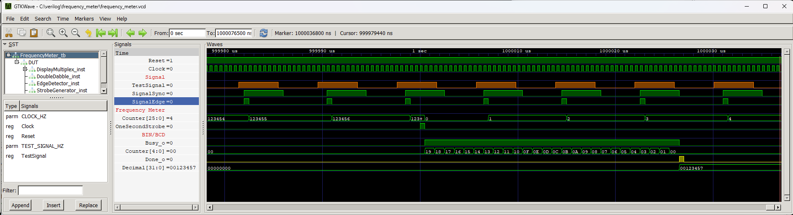

# Frequency meter


A simple frequency meter. To the `SignalAsync_i` input, connect the signal whose frequency you want to measure. The measured signal is synchronized with the clock domain in the FPGA using the `Synchronizer` module, and then the rising edges of this signal are detected using the `EdgeDetector` module. The measurement method is to count how many edges of the measured signal occur per second. The result is presented on an 8-digit 7-segment display, using the `DisplayMultiplex` and `DoubleDabble` modules.

## Instantiation

```verilog
	FrequencyMeter #(
		.CLOCK_HZ(CLOCK_HZ)
	) DUT(
		.Clock(Clock),
		.Reset(Reset),
		.SignalAsync_i(),
		.Cathodes_o(),
		.Segments_o()
	);
```

## Port description

+ **CLOCK_HZ** - Clock signal frequency [Hz].
+ **Clock** - Clock signal, active rising edge.
+ **SignalAsync_i** - Input of measured signal.
+ **Cathodes_o[7:0]** - GPIO pins controlling the display cathodes.
+ **Segments_o[7:0]** - GPIO pins controlling the display segments.
    
## Simulation



## Console output

	VCD info: dumpfile frequency_meter.vcd opened for output.
	===== START =====
	Test freq: 123456
	Result:    123457
	====== END ======
	frequency_meter_tb.v:62: $finish called at 1000076500 (1ns)

