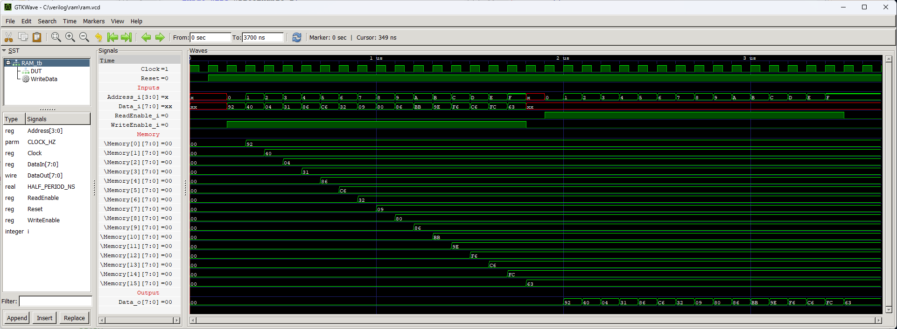

# RAM Memory


Single port RAM.

## Instantiation

```verilog
	RAM #(
		.ADDRESS_WIDTH(),
		.DATA_WIDTH(8)
	) RAM_inst(
		.Clock(Clock),
		.Reset(Reset),
		.ReadEnable_i(),
		.WriteEnable_i(),
		.Address_i(),
		.Data_i(),
		.Data_o()
	);
```

## Port description

+ **ADDRESS_WIDTH** - Number of address bus bits. Determines the size of the memory. The memory size is equal to 2^ADDRESS_WIDTH.
+ **DATA_WIDTH** - Number of data bus bits. Most common values are 8, 16 and 32. 
+ **Clock** - Clock signal, active rising edge.
+ **Reset** - Asynchronous reset, active low.
+ **ReadEnable_i** - If 1 then on the next clock edge the requested data is output on `Data_o`.
+ **WriteEnable_i** - If 1 then on the next clock edge the data delivered on `Data_i` is written to selected address.
+ **Address_i[ADDRESS_WIDTH-1:0]** - Address of the byte requested to be read/written on the next clock edge.
+ **Data_i[DATA_WIDTH-1:0]** - Data to be written to the requestred address.
+ **Data_o[DATA_WIDTH-1:0]** - Data read from the requested address.
    
## Simulation



## Console output

    VCD info: dumpfile ram.vcd opened for output.
    VCD warning: array word RAM_tb.DUT.Memory[0] will conflict with an escaped identifier.
    VCD warning: array word RAM_tb.DUT.Memory[1] will conflict with an escaped identifier.
    VCD warning: array word RAM_tb.DUT.Memory[2] will conflict with an escaped identifier.
    VCD warning: array word RAM_tb.DUT.Memory[3] will conflict with an escaped identifier.
    VCD warning: array word RAM_tb.DUT.Memory[4] will conflict with an escaped identifier.
    VCD warning: array word RAM_tb.DUT.Memory[5] will conflict with an escaped identifier.
    VCD warning: array word RAM_tb.DUT.Memory[6] will conflict with an escaped identifier.
    VCD warning: array word RAM_tb.DUT.Memory[7] will conflict with an escaped identifier.
    VCD warning: array word RAM_tb.DUT.Memory[8] will conflict with an escaped identifier.
    VCD warning: array word RAM_tb.DUT.Memory[9] will conflict with an escaped identifier.
    VCD warning: array word RAM_tb.DUT.Memory[10] will conflict with an escaped identifier.
    VCD warning: array word RAM_tb.DUT.Memory[11] will conflict with an escaped identifier.
    VCD warning: array word RAM_tb.DUT.Memory[12] will conflict with an escaped identifier.
    VCD warning: array word RAM_tb.DUT.Memory[13] will conflict with an escaped identifier.
    VCD warning: array word RAM_tb.DUT.Memory[14] will conflict with an escaped identifier.
    VCD warning: array word RAM_tb.DUT.Memory[15] will conflict with an escaped identifier.
    ===== START =====
            Time Address DataIn DataOut
         0.000us       x     xx      00
         0.200us       0     92      00
         0.300us       1     40      00
         0.400us       2     04      00
         0.500us       3     31      00
         0.600us       4     86      00
         0.700us       5     c6      00
         0.800us       6     32      00
         0.900us       7     09      00
         1.000us       8     80      00
         1.100us       9     86      00
         1.200us       a     bb      00
         1.300us       b     9e      00
         1.400us       c     f6      00
         1.500us       d     c6      00
         1.600us       e     fc      00
         1.700us       f     63      00
         1.800us       x     xx      00
         1.900us       0     xx      00
         2.000us       1     xx      92
         2.100us       2     xx      40
         2.200us       3     xx      04
         2.300us       4     xx      31
         2.400us       5     xx      86
         2.500us       6     xx      c6
         2.600us       7     xx      32
         2.700us       8     xx      09
         2.800us       9     xx      80
         2.900us       a     xx      86
         3.000us       b     xx      bb
         3.100us       c     xx      9e
         3.200us       d     xx      f6
         3.300us       e     xx      c6
         3.400us       f     xx      fc
         3.500us       f     xx      63
    ===== END =====
    ram_tb.v:85: $finish called at 3700 (1ns)
