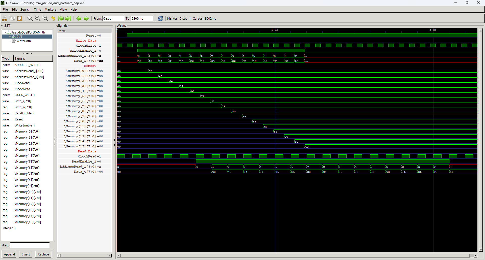

# Pseudo Dual Port RAM Memory


RAM memory with a separate address port for reading data and a separate one for writing. Moreover, the write and read ports can be connected to completely different clock signals.

## Instantiation

```verilog	
	PseudoDualPortRAM #(
		.ADDRESS_WIDTH(),
		.DATA_WIDTH(8)
	) DUT(
		.ClockRead(ClockRead),
		.ClockWrite(ClockWrite),
		.Reset(Reset),
		.ReadEnable_i(),
		.WriteEnable_i(),
		.AddressRead_i(),
		.AddressWrite_i(),
		.Data_i(),
		.Data_o()
	);
```

## Port description

+ **ADDRESS_WIDTH** - Number of address bus bits. Determines the size of the memory. The memory size is equal to 2^ADDRESS_WIDTH.
+ **DATA_WIDTH** - Number of data bus bits. Most common values are 8, 16 and 32. 
+ **ClockRead** - Clock signal for read port, active rising edge.
+ **ClockWrite** - Clock signal for write port, active rising edge.
+ **Reset** - Asynchronous reset, active low.
+ **ReadEnable_i** - If 1 then on the next clock edge the requested data is output on `Data_o`.
+ **WriteEnable_i** - If 1 then on the next clock edge the data delivered on `Data_i` is written to selected address.
+ **AddressRead_i[ADDRESS_WIDTH-1:0]** - Address of the byte requested to be read on the next clock edge.
+ **AddressWrite_i[ADDRESS_WIDTH-1:0]** - Address of the byte requested to be written on the next clock edge.
+ **Data_i[DATA_WIDTH-1:0]** - Data to be written to the requestred address.
+ **Data_o[DATA_WIDTH-1:0]** - Data read from the requested address.
    
## Simulation



## Console output

    VCD info: dumpfile ram_pdp.vcd opened for output.
    VCD warning: array word PseudoDualPortRAM_tb.DUT.Memory[0] will conflict with an escaped identifier.
    VCD warning: array word PseudoDualPortRAM_tb.DUT.Memory[1] will conflict with an escaped identifier.
    VCD warning: array word PseudoDualPortRAM_tb.DUT.Memory[2] will conflict with an escaped identifier.
    VCD warning: array word PseudoDualPortRAM_tb.DUT.Memory[3] will conflict with an escaped identifier.
    VCD warning: array word PseudoDualPortRAM_tb.DUT.Memory[4] will conflict with an escaped identifier.
    VCD warning: array word PseudoDualPortRAM_tb.DUT.Memory[5] will conflict with an escaped identifier.
    VCD warning: array word PseudoDualPortRAM_tb.DUT.Memory[6] will conflict with an escaped identifier.
    VCD warning: array word PseudoDualPortRAM_tb.DUT.Memory[7] will conflict with an escaped identifier.
    VCD warning: array word PseudoDualPortRAM_tb.DUT.Memory[8] will conflict with an escaped identifier.
    VCD warning: array word PseudoDualPortRAM_tb.DUT.Memory[9] will conflict with an escaped identifier.
    VCD warning: array word PseudoDualPortRAM_tb.DUT.Memory[10] will conflict with an escaped identifier.
    VCD warning: array word PseudoDualPortRAM_tb.DUT.Memory[11] will conflict with an escaped identifier.
    VCD warning: array word PseudoDualPortRAM_tb.DUT.Memory[12] will conflict with an escaped identifier.
    VCD warning: array word PseudoDualPortRAM_tb.DUT.Memory[13] will conflict with an escaped identifier.
    VCD warning: array word PseudoDualPortRAM_tb.DUT.Memory[14] will conflict with an escaped identifier.
    VCD warning: array word PseudoDualPortRAM_tb.DUT.Memory[15] will conflict with an escaped identifier.
    ===== START =====
            Time AddressWrite DataIn AddressRead DataOut
         0.000us            x     xx           x      00
         0.132us            0     92           x      00
         0.198us            1     40           x      00
         0.264us            2     04           x      00
         0.330us            3     31           x      00
         0.396us            4     86           x      00
         0.462us            5     c6           x      00
         0.500us            5     c6           0      00
         0.528us            6     32           0      00
         0.594us            7     09           0      00
         0.600us            7     09           1      92
         0.660us            8     80           1      92
         0.700us            8     80           2      40
         0.726us            9     86           2      40
         0.792us            a     bb           2      40
         0.800us            a     bb           3      04
         0.858us            b     9e           3      04
         0.900us            b     9e           4      31
         0.924us            c     f6           4      31
         0.990us            d     c6           4      31
         1.000us            d     c6           5      86
         1.056us            e     fc           5      86
         1.100us            e     fc           6      c6
         1.122us            f     63           6      c6
         1.188us            x     xx           6      c6
         1.200us            x     xx           7      32
         1.300us            x     xx           8      09
         1.400us            x     xx           9      80
         1.500us            x     xx           a      86
         1.600us            x     xx           b      bb
         1.700us            x     xx           c      9e
         1.800us            x     xx           d      f6
         1.900us            x     xx           e      c6
         2.000us            x     xx           f      fc
         2.100us            x     xx           x      63
    ===== END =====
    ram_pdp_tb.v:106: $finish called at 2300 (1ns)
