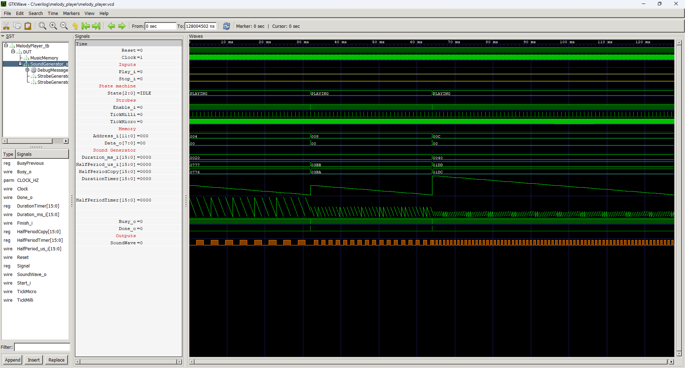

# Verilog FPGA
This is my repo with various peripherals coded in Verilog that I use in my FPGA projects. I use this as a code base and a library of many useful things that I can just copy-paste into something more advanced. 

I decided to publish these peripherals because I think they may be useful for other Verilog coders. Feel free to download all of them and use them without any limits. It would be nice if you mention me (Dominik Bieczyński) in your project description.

# Modules

Described in the alphabetical order.

## Melody Player

>**Status**: during development

This module is superior to the `SoundGenerator` module, which can only play a single sound at the desired frequency for the desired duration. The `MelodyPlayer` module is equipped with a ROM that contains music notes and their length of time. After starting the module with the `Play` signal, the module reads consecutive sounds from the memory and pushes them to the SoundGenerator. This way, a melody player with capabilities similar to the ringtone composer from the Nokia 3310 can be realized.

**Instantiation**

    MelodyPlayer #(
        .CLOCK_HZ(CLOCK_HZ)
    ) DUT(
        .Clock(Clock),
        .Reset(Reset),
        .Play_i(),
        .Stop_i(),
        .SoundWave_o()
    );

**Port description**

+ **CLOCK_HZ** - Clock signal frequency [Hz]
+ **Clock** - Clock signal, active rising edge.
+ **Reset** - Asynchronous reset, active low.
+ **Play_i** - A high pulse triggers the start of melody playback.
+ **Stop_i** - A high pulse stops the operation.
+ **SoundWave_o** - Connect to the speaker.

**Simulation**

**Console output**

    VCD info: dumpfile melody_player.vcd opened for output.
    ===== START =====
            Time Durat HaPer        Freq
         1.700us     5   100        5000
      5002.300us     2     0           x
      7002.900us     8   500        1000
     15003.500us     5    50       10000
     20004.100us     0     0           x
    ====== END ======
    melody_player_tb.v:60: $finish called at 20005102 (1ns)

## ROM - case implementation

>**Status**: ready

This is very a simple implementation of ROM memory using `case` instruction. It has no practical sense - but can be used for educational purposes.

**Instantiation**

    ROM ROM_inst(
        .Clock(Clock),
        .ReadEnable_i(),
        .Address_i(),
        .Data_o()
    );

**Port description**

+ **Clock** - Clock signal, active rising edge.
+ **ReadEnable_i** - If 1 then on the next clock edge the requested data is ready.
+ **Address_i** - Address of the byte requested to be read on the next clock edge.
+ **Data_o** - Value of the requested byte.
    
**Simulation**

**Console output**

    VCD info: dumpfile rom.vcd opened for output.
    ===== START =====
            Time Ad Data
         0.400us 0: 00
         0.700us 1: 10
         1.000us 2: 02
         1.300us 3: 30
         1.600us 4: 04
         1.900us 5: 55
         2.200us 6: 60
         2.500us 7: 07
         2.800us 8: 88
         3.100us 9: 90
         3.400us a: 0a
         3.700us b: b0
         4.000us c: cc
         4.300us d: 0d
         4.600us e: e0
         4.900us f: ff
    ===== END =====
    rom_tb.v:69: $finish called at 7502 (1ns)

## Sound Generator

>**Status**: during development

The `SoundGenerator` module generates sound of the desired frequency and duration. Together with the `Player` module, you can easily build a simple melody player with capabilities similar to Nokia 3310.

**Instantiation**

    SoundGenerator #(
        .CLOCK_HZ(CLOCK_HZ)
    ) SoundGenerator_inst(
        .Clock(Clock),
        .Reset(Reset),
        .Start_i(),
        .Finish_i(),
        .Duration_ms_i(),
        .HalfPeriod_us_i(),
        .SoundWave_o(),
        .Busy_o(),
        .Done_o()
    );

**Instantiation**

TODO

**Port description**

TODO

**Simulation**

TODO

**Console output**

TODO

## Strobe Generator

>**Status**: ready

This is a very simple yet very useful module.. I use it almost in every project.

The strobe signal assumes a high state for one clock cycle. This module generates periodic page signals. The period of the strobes is defined by the `PERIOD_US` parameter. Based on the `CLOCK_HZ` parameter, the module itself calculates how many clock cycles to wait between strobe signals to occur at the desired intervals. The module also calculates by itself the number of bits of the Counter register, used to count clock ticks, in such a way that FPGA resources are not wasted on unnecessary register bits.

**Instantiation**

    StrobeGenerator #(
        .CLOCK_HZ(CLOCK_HZ),
        .PERIOD_US()
    ) StrobeGenerator_inst(
        .Clock(Clock),
        .Reset(Reset),
        .Enable_i(),
        .Strobe_o()
    );

**Port description**

+ **CLOCK_HZ** - Clock signal frequency [Hz]
+ **PERIOD_US** - Period of strobe signals [us]
+ **Clock** - Clock signal, active rising edge.
+ **Reset** - Asynchronous reset, active low.
+ **Enable_i** - If 0 then pause. If 1 then start operation. This input can be used as a synchronous reset.
+ **Strobe_o** - Output of the strobe periodic strobe signal.

**Simulation**

**Console output**

    VCD info: dumpfile strobe_generator.vcd opened for output.
    ===== START =====
    CLOCK_HZ  =  10000000
    PERIOD_US =         2
    DELAY     =        19
    WIDTH     =         5
    Strobe detected at    2.000us
    Strobe detected at    4.000us
    Strobe detected at    8.100us
    Strobe detected at   10.100us
    Strobe detected at   13.200us
    Strobe detected at   15.200us
    ===== END =====
    strobe_generator_tb.v:82: $finish called at 15201000 (1ps)
