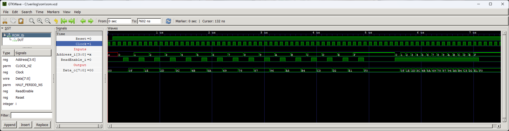

# ROM Memory

Read only memory. This module can be used to store permanent information, such as the code of a program executed by the processor, for example.

## Instantiation
    
    ROM #(
        .ADDRESS_WIDTH(),
        .DATA_WIDTH(),
        .MEMORY_FILE("data.mem")
    ) ROM_inst(
        .Clock(Clock),
        .Reset(Reset),
        .ReadEnable_i(),
        .Address_i(),
        .Data_o()
    );

## Port description

+ **ADDRESS_WIDTH** - Number of address bus bits. Determines the size of the memory. The memory size is equal to 2^ADDRESS_WIDTH.
+ **DATA_WIDTH** - Number of data bus bits. Most common values are 8, 16 and 32. 
+ **MEMORY_FILE** - A file with the contents of the memory to be loaded as soon as the device starts up.
+ **Clock** - Clock signal, active rising edge.
+ **Reset** - Asynchronous reset, active low.
+ **ReadEnable_i** - If 1 then on the next clock edge the requested data is ready.
+ **Address_i[ADDRESS_WIDTH-1:0]** - Address of the byte requested to be read on the next clock edge.
+ **Data_o[DATA_WIDTH-1:0]** - Value of the requested byte.
    
## Simulation

## Console output

    VCD info: dumpfile rom.vcd opened for output.
    ===== START =====
            Time Ad Data
         0.500us 0: 0f
         0.800us 1: 1e
         1.100us 2: 2d
         1.400us 3: 3c
         1.700us 4: 4b
         2.000us 5: 5a
         2.300us 6: 69
         2.600us 7: 78
         2.900us 8: 87
         3.200us 9: 96
         3.500us a: a5
         3.800us b: b4
         4.100us c: c3
         4.400us d: d2
         4.700us e: e1
         5.000us f: f0
    ===== END =====
    rom_tb.v:78: $finish called at 7602 (1ns)