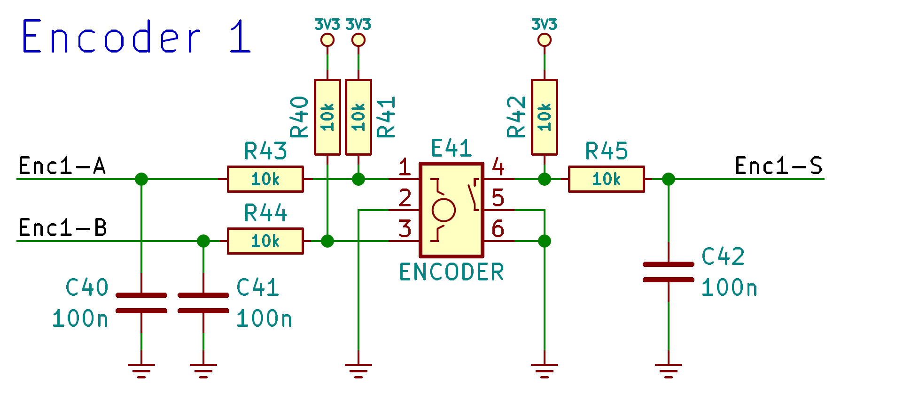

# Rotary Encoder


Module supporting a rotary encoder. Allows recognition of increment and decrement signals of ecoders, which have four pulses per click. 

The rotary encoder should be connected as shown in the schematic. The FPGA chip pins connected to the encoder should have hysteresis enabled.



## Instantiation

```verilog
	Encoder Encoder_inst(
		.Clock(Clock),
		.Reset(Reset),
		.AsyncA_i(),
		.AsyncB_i(),
		.Increment_o(),
		.Decrement_o()
	);
```

## Port description

+ **Clock** - Clock signal, active rising edge.
+ **Reset** - Asynchronous reset, active low.
+ **AsyncA_i** - Asyncronous input from encoder's pin A.
+ **AsyncB_i** - Asyncronous input from encoder's pin B.
+ **Increment_o** - Signal set to high state for one clock cycle if encoder increment is detected.
+ **Decrement_o** - Signal set to high state for one clock cycle if encoder decrement is detected.

## Simulation


## Console output

    VCD info: dumpfile encoder.vcd opened for output.
    ===== START =====
    ===== END =====
    encoder_tb.v:83: $finish called at 30128 (1ns)
