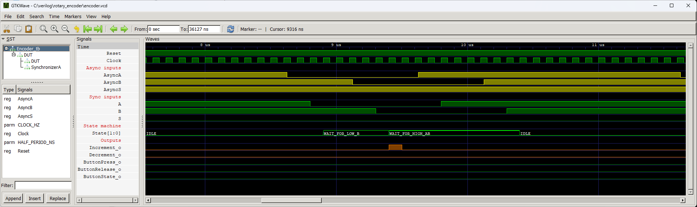

# Rotary Encoder


Module supporting a rotary encoder with a button. Allows recognition of increment and decrement signals of ecoders, which have four pulses per click. Also, it generates a pulse if a button is pressed or released.

The rotary encoder should be connected as shown in the schematic. The FPGA chip pins connected to the encoder should have hysteresis enabled.


## Instantiation

```verilog
	Encoder Encoder_inst(
		.Clock(Clock),
		.Reset(Reset),
		.AsyncA_i(),
		.AsyncB_i(),
		.AsyncS_i(),
		.Increment_o(),
		.Decrement_o(),
		.ButtonPress_o(),
		.ButtonRelease_o(),
		.ButtonState_o()		
	);
```

## Port description

+ **Clock** - Clock signal, active rising edge.
+ **Reset** - Asynchronous reset, active low.
+ **AsyncA_i** - Asyncronous input from encoder's pin A.
+ **AsyncB_i** - Asyncronous input from encoder's pin B.
+ **AsyncS_i** - Asyncronous input from encoder's button.
+ **Increment_o** - Signal set to high state for one clock cycle if encoder increment is detected.
+ **Decrement_o** - Signal set to high state for one clock cycle if encoder decrement is detected.
+ **ButtonPress_o** - Signal set to high state for one clock cycle if the button press has been recognized.
+ **ButtonRelease_o** - Signal set to high state for one clock cycle if the button release has been recognized.
+ **ButtonState_o** - State of the button synchronized with the clock domain.

## Simulation





## Console output

	VCD info: dumpfile encoder.vcd opened for output.
	===== START =====
	====== END ======
	encoder_tb.v:104: $finish called at 36127 (1ns)
