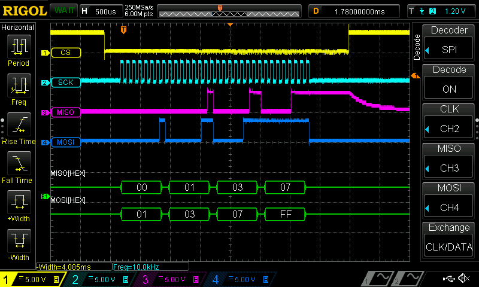

# Slave SPI interface


A full duplex module to connect the FPGA and CPU via SPI interface. The CPU works as a master and the FPGA as a slave. The CS, SCK and MOSI inputs are synchronized with the clock domain of the FPGA chip. Additional outputs indicate events such as the start and end of transmission, as well as the sending/receiving of a data byte.

The MISO pin goes to a high impedance state when the CS input is in a high state. This makes it possible to connect several slaves to a single master.

The module does not support CPOL and CPHA configuration. I figured there was no need for this, as all the chips I knew with SPI interface used CPOL=0 and CPHA=0 configuration (also known as Mode 0).



## Instantiation

```verilog
	SlaveSPI SlaveSPI_inst(
		.Clock(Clock),
		.Reset(Reset),
		.CS_i(),
		.SCK_i(),
		.MOSI_i(),
		.MISO_o(),
		.DataToSend_i(),
		.DataReceived_o(),
		.TransactionDone_o(),
		.TransmissionStart_o(),
		.TransmissionEnd_o()
	);
```

## Port description

+ **Clock** - Clock signal, active rising edge.
+ **Reset** - Asynchronous reset, active low.
+ **CS_i** - Chip select, active low. When high, the module ignores SCK and MOSI.
+ **SCK_i** - SPI clock signal, driven by the master.
+ **MOSI_i** - Master Out, Slave In.
+ **MISO_o** - Master In, Slave Out.
+ **DataToSend_i[7:0]** - A byte that should be send, when the master initiates a data transfer.
+ **DataReceived_o[7:0]** - A byte received from the master.
+ **TransactionDone_o** - High strobe indicates that data on `DataReceived_o` is ready to be read and (if needed) the answer byte should be delivered to `DataToSend_i` before next SCK cycle.
+ **TransmissionStart_o** - High strobe indicates that CS has been set low, so the master has started a data transfer. This is useful to initiate a state machine that reads received bytes and performs some operation.
+ **TransmissionEnd_o** - High strobe indicates that CS has been set high, so the master has finished the data transfer. This signal could be used to request the state machine to execute a command received via SPI.

## Simulation


## Console output

	===== START =====
	SCK freq is 63339.244996 Hz
	  40.470us Transmitting: 80 10000000
	 161.000us Received:     80 10000000
	 174.668us Transmitting: 40 01000000
	 308.866us Transmitting: 20 00100000
	 430.000us Received:     20 00100000
	 443.064us Transmitting: 10 00010000
	 564.000us Received:     10 00010000
	====== END ======

