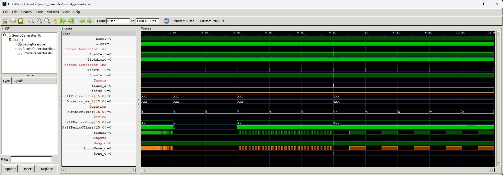

# Sound Generator

>**Status**: ready

The `SoundGenerator` module generates sound of the desired frequency and duration. Together with the `Player` module, you can easily build a simple melody player with capabilities similar to Nokia 3310.

## Instantiation

    SoundGenerator #(
        .CLOCK_HZ(CLOCK_HZ)
    ) SoundGenerator_inst(
        .Clock(Clock),
        .Reset(Reset),
        .Start_i(),
        .Finish_i(),
        .Duration_ms_i(),
        .HalfPeriod_us_i(),
        .SoundWave_o(),
        .Busy_o(),
        .Done_o()
    );

## Port description

+ **CLOCK_HZ** - Clock signal frequency [Hz].
+ **Clock** - Clock signal, active rising edge.
+ **Reset** - Asynchronous reset, active low.
+ **Start_i** - A high strobe causes begin of the operation.
+ **Finish_i** - A high strobe causes immediate break the operation.
+ **Duration_ms_i[15:0]** - How long the sound has to be played [ms].
+ **HalfPeriod_us_i[15:0]** - Required half wave period of the sound signal.
+ **SoundWave_o** - Output sound signal.
+ **Busy_o** - This signal is set to high as long as the sound is being played.
+ **Done_o** - A single high pulse signals the end of the operation.

## Simulation

## Console output

	VCD info: dumpfile sound_generator.vcd opened for output.
	===== START =====
			Time Durat HaPer        Freq
		 1.100us     1    10       50000
	  1001.200us     2     0           x
	  3001.200us     3     1      500000
	  6001.200us     0    99        5050
	  6001.800us    10   500        1000
	===== END =====
	sound_generator_tb.v:116: $finish called at 11003002 (1ns)
