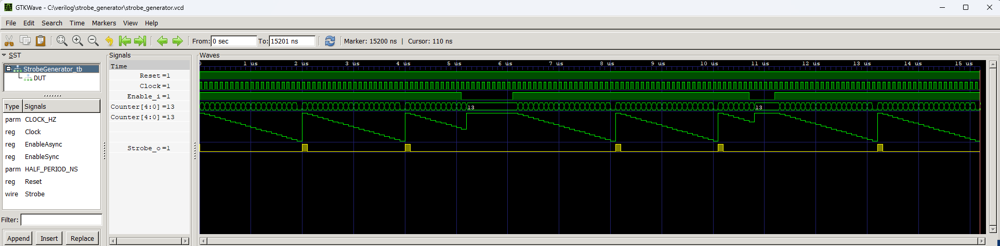

# Strobe Generator

>**Status**: ready

This is a very simple yet very useful module. I use it almost in every project.

The strobe signal is set to high state for one clock cycle and then it is set low. This kind of signal is very common to drice `ClockEnale` inputs. This module generates periodic page signals. The period of the strobes is defined by the `PERIOD_US` parameter. Based on the `CLOCK_HZ` parameter, the module itself calculates how many clock cycles to wait between strobe signals to occur at the desired intervals. The module also calculates by itself the number of bits of the Counter register, used to count clock ticks, in such a way that FPGA resources are not wasted on unnecessary register bits.

## Instantiation

    StrobeGenerator #(
        .CLOCK_HZ(CLOCK_HZ),
        .PERIOD_US()
    ) StrobeGenerator_inst(
        .Clock(Clock),
        .Reset(Reset),
        .Enable_i(),
        .Strobe_o()
    );

## Port description

+ **CLOCK_HZ** - Clock signal frequency [Hz].
+ **PERIOD_US** - Period of strobe signals [us].
+ **Clock** - Clock signal, active rising edge.
+ **Reset** - Asynchronous reset, active low.
+ **Enable_i** - If 0 then pause. If 1 then start operation. This input can be used as a synchronous reset.
+ **Strobe_o** - Output of the strobe periodic strobe signal.

## Simulation

## Console output

    VCD info: dumpfile strobe_generator.vcd opened for output.
    ===== START =====
    CLOCK_HZ  =  10000000
    PERIOD_US =         2
    DELAY     =        19
    WIDTH     =         5
    Strobe detected at    2.000us
    Strobe detected at    4.000us
    Strobe detected at    8.100us
    Strobe detected at   10.100us
    Strobe detected at   13.200us
    Strobe detected at   15.200us
    ===== END =====
    strobe_generator_tb.v:82: $finish called at 15201000 (1ps)
