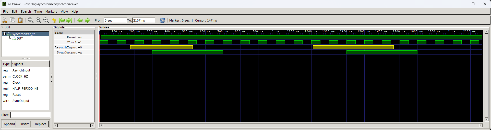

# Synchronizer


A module for synchronizing asynchronous inputs with the clock domain of an FPGA. The implementation of this module at the GPIO input pins solves the problem of metastability. Changes in the state of the asynchronous input are visible on the synchronous output, but are delayed by a maximum of 2 clock cycles.

## Instantiation

```verilog
	Synchronizer #(
		.WIDTH()
	) Synchronizer_inst(
		.Clock(Clock),
		.Reset(Reset),
		.Async_i(AsynchInput),
		.Sync_o(SyncOutput)
	);
```

## Port description

+ **WIDTH** - The width of the input and output in bits.
+ **Clock** - Clock signal, active rising edge.
+ **Reset** - Asynchronous reset, active low.
+ **Async_i[WIDTH-1:0]** - Asynchronous input.
+ **Sync_o[WIDTH-1:0]** - Syncronous output.

## Simulation



## Console output

	VCD info: dumpfile synchronizer.vcd opened for output.
	===== START =====
		  Time Reset AsynchInput SyncOutput
	   0.000us     x        0000       xxxx
	   0.005us     0        0000       0000
	   0.010us     1        0000       0000
	   0.175us     1        0001       0000
	   0.300us     1        0001       0001
	   0.528us     1        0000       0001
	   0.700us     1        0000       0000
	   1.210us     1        0011       0000
	   1.400us     1        0011       0011
	   1.666us     1        0000       0011
	   1.800us     1        0000       0000
	====== END ======
	synchronizer_tb.v:58: $finish called at 2166 (1ns)
