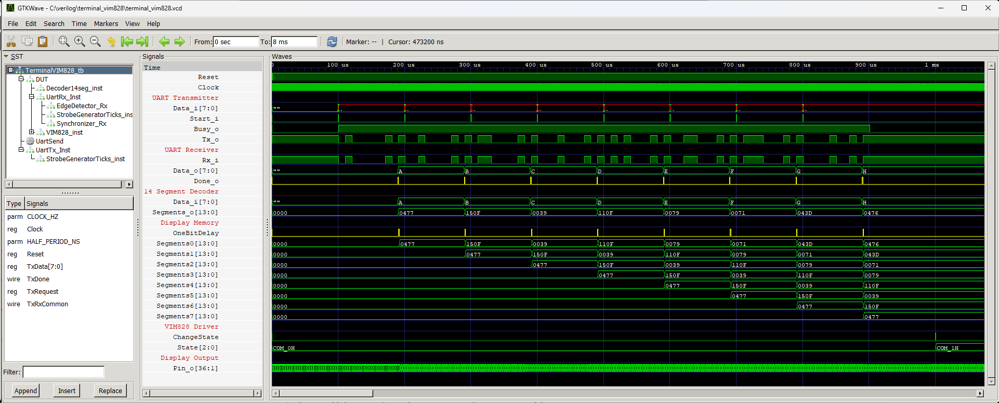

# UART terminal with VIM828 display


A module that combines the functionality of a UART receiver, a 14-segment decoder and a VIM828 display controller. When a character is received by the UART, it is converted into a 14-segment code and shown on the display. The display shows the eight most recently received characters.

## Instantiation

```verilog
	TerminalVIM828 #(
		.CLOCK_HZ(CLOCK_HZ),
		.BAUD()
	) TerminalVIM828_inst(
		.Clock(Clock),
		.Reset(Reset),
		.Rx_i(),
		.Pin_o()
	);
```

## Port description

+ **Clock** - Clock signal, active rising edge.
+ **Reset** - Asynchronous reset, active low.
+ **Rx_i** - UART receiver input.
+ **Pin_0[36:1]** - Connect to VIM828 display.
  
## Simulation




## Console output

	VCD info: dumpfile decoder_14seg.vcd opened for output.
	===== START =====
	CLOCK_HZ =   1000000
	====== END ======
	decoder_14seg_tb.v:48: $finish called at 99000 (1ns)


