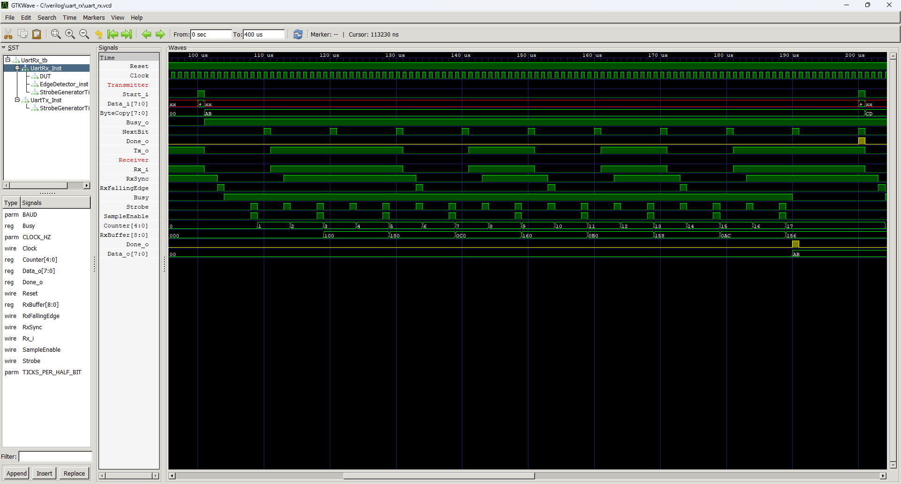

# UART Receiver


Simple UART receiver. Supports the most common configuration, that is, 8-bit data transmission with one stop bit and no parity bit.

The UART input should be routed to the `Rx_i` port. The module has a synchronizer that synchronizes the input signal with the clock domain. After recognizing the falling edge of the `Rx_i` signal, the module starts its clock and samples the input every specified time intervals, resulting from the desired baud rate, specified by the `BAUD` parameter. When transmission is complete, the `Done_o` output is set high for one clock cycle, and the last byte received byte is available on `Data_o` output.

## Instantiation

```verilog
	UartRx #(
		.CLOCK_HZ(CLOCK_HZ),
		.BAUD(115200)
	) UartRx_Inst(
		.Clock(Clock),
		.Reset(Reset),
		.Rx_i(),
		.Done_o(),
		.Data_o()
	);
```

## Port description

+ **CLOCK_HZ** - Clock signal frequency [Hz].
+ **BAUD** - Bits per second.
+ **Clock** - Clock signal, active rising edge.
+ **Reset** - Asynchronous reset, active low.
+ **Rx_i** - UART receiver input, can be connected directly to the FPGA's GPIO.
+ **Done_o** - A single high pulse signals the end of the operation. New data can be read from `Data_o`.
+ **Data_o[7:0]** - Last received byte.

## Simulation

Example of sending and receiving of two bytes at 100000 baud.





## Console output

	VCD info: dumpfile uart_rx.vcd opened for output.
	===== START =====
	Ticks per half bit = 5
	   100.000us Transmitting byte: ab «
	   190.000us Received byte:     ab «
	   200.000us Transmitting byte: cd Í
	   290.000us Received byte:     cd Í
	====== END ======
	uart_rx_tb.v:93: $finish called at 400000 (1ns)
