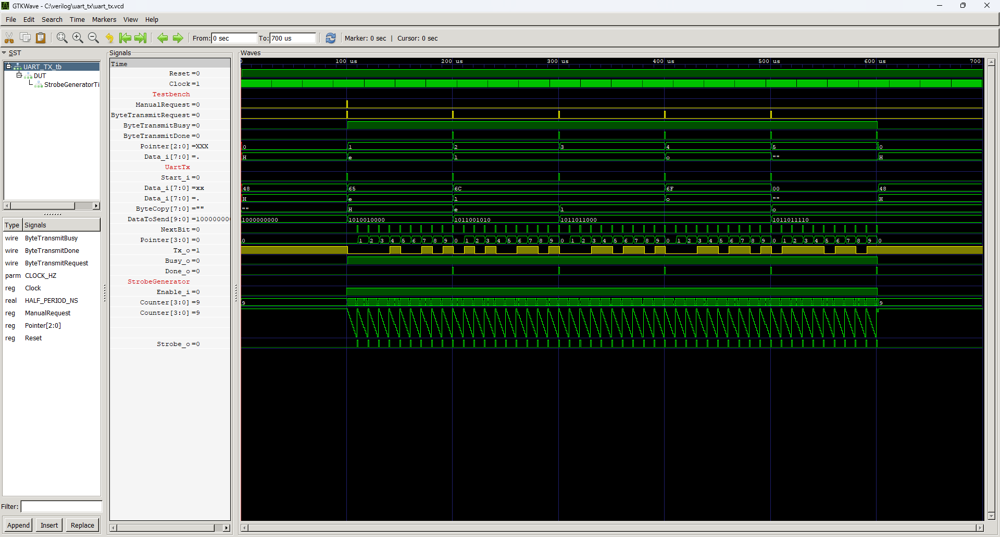
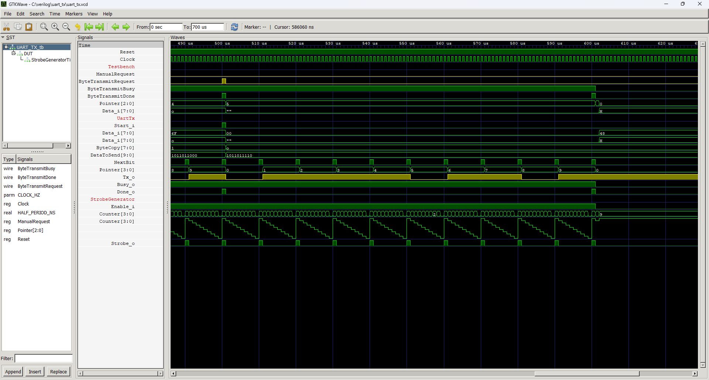

# UART Transmitter


UART transceiver developed to be as easy to use as possible. It supports 8-bit data transmission with one stop bit and no parity bit - the most common configuration.

To start the transmission, feed the data to be sent to the `Data_i` input and set the `Start_i` input high for the length of one clock cycle. You can then set the next byte to be sent, but wait until the `Done_o` output is high. Then you can transmit the next byte. To speed up communication, you can loop the `Done_o` output with the `Start_i` input so that the completion of sending a byte starts sending the next one.

## Instantiation

```verilog
	UART_TX #(
		.CLOCK_HZ(CLOCK_HZ),
		.BAUD(115200)
	) DUT(
		.Clock(Clock),
		.Reset(Reset),
		.Start_i(),
		.Data_i(),
		.Busy_o(),
		.Done_o(),
		.Tx_o()
	);
```

## Port description

+ **CLOCK_HZ** - Clock signal frequency [Hz].
+ **BAUD** - Bits per second.
+ **Clock** - Clock signal, active rising edge.
+ **Reset** - Asynchronous reset, active low.
+ **Start_i** - High strobe initiates the transmission.
+ **Data_i[7:0]** - A byte to be transmitted.
+ **Busy_o** - High as long as transmission is in progress.
+ **Done_o** - A single high pulse signals the end of the operation. New data can be loaded at this moment using `Start_i` and `Data_i`.
+ **Tx_o** - The output of UART transmitter.

## Simulation

Example of transmitting `Hello` at 100000 baud.





## Console output

    VCD info: dumpfile uart_tx.vcd opened for output.
    ===== START =====
    Ticks per bit =        10
    ====== END ======
    uart_tx_tb.v:91: $finish called at 700000 (1ns)
