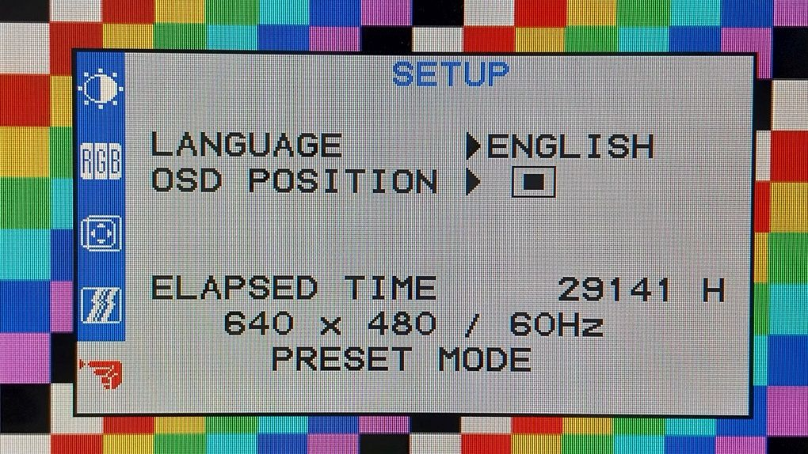

# VGA Simple Demo


Description

640x480 60Hz





## Instantiation

```verilog
	VGA VGA_inst(
		.Clock(Clock),
		.Reset(Reset),
		.HSync_o(),
		.VSync_o(),
		.Red_o(),
		.Green_o(),
		.Blue_o()
	);
```

## Port description

+ **Clock** - Clock signal, active rising edge. Must be 25 or 25.175 MHz
+ **Reset** - Asynchronous reset, active low.
+ **HSync_o** - Horizontal sync pulse.
+ **VSync_o** - Vertical sync pulse.
+ **Red_o** - Red channel signal.
+ **Green_o** - Green channel signal.
+ **Blue_o** - Blue channel signal.

## Simulation


## Console output

	VCD info: dumpfile vga.vcd opened for output.
	===== START =====
	===== END =====
	vga_tb.v:47: $finish called at 17001055722 (1ps)
